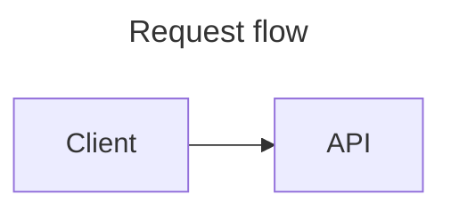

# pipelign-diagrams

`pipelign-diagrams` is a FastAPI service for validating and rendering diagrams on
the server. It exposes one API for two first-class source languages:

| Language | SVG | PNG | ASCII |
| --- | --- | --- | --- |
| `plantuml` | Yes | Yes | Yes |
| `mermaid` | Yes | Yes | No |

PlantUML is rendered with the bundled official JAR. Mermaid is rendered with the
official [`@mermaid-js/mermaid-cli`](https://github.com/mermaid-js/mermaid-cli)
and headless Chromium. The service selects a backend from the request's
`language`; it does not translate between diagram languages.

## API

The Docker default base URL is `http://localhost:8080`.

- `GET /` retains the legacy playground asset; see browser limitations below.
- `GET /health` returns `{"status":"ok"}` (public liveness only).
- `GET /ready` authenticates, exercises both engines once per process, and returns build metadata.
- `POST /render/svg` returns SVG as `image/svg+xml`.
- `POST /render/png` returns PNG bytes as `image/png`.
- `POST /render/ascii` returns PlantUML ASCII output as `text/plain`.
- `POST /validate` validates source without returning rendered output.

All endpoints except `/health` require `Authorization: Bearer <service token>`.
Set `DIAGRAM_API_TOKEN` to at least 32 non-whitespace ASCII characters. Missing
configuration fails closed with 503; missing/wrong credentials return 401.
Keep the token in secret injection or an ignored `.env`, never in source control.
For rotation, deploy the new token as current and the old one as
`DIAGRAM_API_TOKEN_PREVIOUS`, update callers, then remove the previous token.
Private ingress and HTTPS are still required outside loopback development.

All POST endpoints accept the same body:

```json
{
  "language": "mermaid",
  "source": "flowchart LR\n  Client --> API",
  "options": null
}
```

`language` accepts `plantuml` or `mermaid`. It defaults to `plantuml`, so existing
PlantUML requests that only send `source` remain compatible. `options` is reserved
for future renderer-specific settings; only null or an empty object is accepted.

Render a Mermaid diagram to SVG:

```bash
curl --fail-with-body \
  --header "Authorization: Bearer ${DIAGRAM_API_TOKEN}" \
  --header 'Content-Type: application/json' \
  --data '{"language":"mermaid","source":"flowchart LR\n  A --> B"}' \
  http://localhost:8080/render/svg \
  --output diagram.svg
```

Render a PlantUML diagram to PNG using the backward-compatible default language:

```bash
curl --fail-with-body \
  --header "Authorization: Bearer ${DIAGRAM_API_TOKEN}" \
  --header 'Content-Type: application/json' \
  --data '{"source":"@startuml\nAlice -> Bob: Hi\n@enduml"}' \
  http://localhost:8080/render/png \
  --output diagram.png
```

### Responses and errors

Invalid diagram source returns HTTP 400 with a `ValidationResult`:

```json
{
  "ok": false,
  "errors": [{"message": "Parse error in Mermaid diagram.", "line": 2}],
  "warnings": []
}
```

An unsupported language value is rejected as request validation with HTTP 422.
An unsupported language/format combination, such as Mermaid ASCII, returns HTTP
400 with the same validation schema. Unexpected renderer failures return HTTP 500
with a stable `InternalErrorResponse`; subprocess commands, paths, stack traces,
and raw renderer output are kept out of responses and logs at every log level.
Policy/size errors use 400/413/422, engine deadlines use 504, and overload uses
503 with `Retry-After: 1`. There is one render slot and no pending render queue.
Syntax diagnostics contain static messages and engine-derived, one-based lines;
a parser may identify end-of-input immediately after the final source line.

Responses include `X-Diagram-Error` for service-level failures. PlantUML failures
also retain the existing `X-PlantUML-Error` header for compatibility.

The authenticated OpenAPI schema remains at `/openapi.json`. Response headers
bind successful bytes to the input hash, language and build-manifest hash.

### Browser limitations

This version is a machine service. The retained legacy playground and Swagger
assets are behind bearer authentication and restrictive CSP; they are not a
supported direct-browser workflow. Do not distribute the service token to a
browser. Consumers must validate SVG and authorize delivery to their users.
Renderer bytes are not a sanitized publication artifact.

### Restricted rendering profile

Requests are capped at 768 KiB before JSON parsing; source at 128 KiB UTF-8;
engine stdout/output files at 4 MiB; diagnostics at 16 KiB. Each engine has a
20-second wall deadline. Includes, links, external images and configuration
overrides are unsupported. No bundled include libraries are approved yet.
PlantUML uses SANDBOX and a 512 MiB Java heap. Mermaid uses strict mode, SVG text
labels and locked security settings. Chromium runs explicitly with `--no-sandbox`.
The deployment's container is the execution boundary; neither a per-render
namespace nor Chromium's internal sandbox separates requests. A compromised
replica can affect later renders until the replica is replaced.

Engines inherit an allowlisted environment without the bearer secret. A Linux
subreaper collects ordinary descendants (including detached Chromium processes)
on success, timeout and failure, before temporary workspaces are removed. This
is process cleanup, not containment of malicious code. Processes share the
container's filesystem, `/proc` and network. Deployments must enforce private
HTTPS ingress, machine authentication and denied renderer-initiated Internet and
unnecessary VNet egress; do not inject application credentials, useful workload
identities or shared application mounts.

Use the provided non-root Compose limits: 1 CPU, 2 GiB memory, 256 PIDs, read-only
root, 128 MiB temporary filesystem, no capabilities and no new privileges.
Azure must separately enforce and verify its supported resource/network controls;
Compose limits are not evidence of Azure enforcement. Never grant privileged
execution. `/ready` authenticates and fails closed when real engines cannot run.

The build manifest records actual engine/font versions and hashes, fixed options,
policy version and source hash. Deploy by immutable registry digest and retain
that digest separately; the manifest is integrity metadata, not remote attestation.

## Architecture

The HTTP application depends on a small renderer contract rather than on either
CLI directly:

```text
render request
    -> DiagramRenderingService registry
        -> PlantUMLRenderer -> plantuml.jar
        -> MermaidRenderer  -> mmdc -> Chromium
```

`app/renderer.py` defines the backend contract and rendered-output model.
`app/diagram_service.py` owns language registration and dispatch. A new language
can be added by implementing `DiagramRenderer` and registering one instance,
without changing the API routes.

Mermaid CLI does not expose a separate validation-only command, so Mermaid
validation performs an SVG render in an isolated temporary directory and discards
the result. PlantUML continues to use its existing syntax-check mode.

## Docker

The image contains Java, Graphviz, and the bundled PlantUML JAR, plus Node.js,
Mermaid CLI, Chromium, and common fonts. Python dependencies are installed from
`uv.lock`.

Build and run the service:

```bash
docker compose build
docker compose up pipelign-diagrams
```

Run the reload-enabled development service:

```bash
docker compose up pipelign-diagrams-dev
```

Run all unit and renderer integration tests inside the complete image:

```bash
docker compose run --rm pipelign-diagrams-tests
```

The Compose image and containers use the `pipelign-diagrams` name. Production and
development services expose port 8080; run one of them at a time unless you change
the host port.

## Local development with uv

Python dependency management, installation, and execution use
[`uv`](https://docs.astral.sh/uv/). From the repository root:

```bash
uv sync --locked
uv run pipelign-diagrams
```

The server listens on `0.0.0.0:8080` by default. Override `HOST` or `PORT` as
needed. Run the test suite with:

```bash
uv run python -m unittest discover -s tests -v
```

Production rendering requires the built Linux image and its generated manifest.
Host unit tests can run without engines; direct host rendering is unsupported.
The integration tests require:

- Java, Graphviz, and a PlantUML JAR selected by `PLANTUML_JAR_PATH`.
- `mmdc` and a compatible Chromium installation. Set `MERMAID_CMD` and, when
  using a system browser, `MERMAID_PUPPETEER_CONFIG_PATH`.

Tests for an unavailable renderer are skipped automatically. Docker is the
simplest way to run the full integration suite because both backends are already
installed and configured.

## Configuration

| Variable | Default | Purpose |
| --- | --- | --- |
| `DIAGRAM_API_TOKEN` | empty (fails closed) | Current service bearer credential. |
| `DIAGRAM_API_TOKEN_PREVIOUS` | empty | Optional overlapping rotation credential. |
| `HOST` | `0.0.0.0` | API bind host used by the installed command. |
| `PORT` | `8080` | API bind port used by the installed command. |
| `LOG_LEVEL` | `INFO` | Python root logging level. |
| `PLANTUML_JAR_PATH` | `/app/plantuml/plantuml.jar` | PlantUML JAR path. |
| `PLANTUML_TIMEOUT_SECONDS` | `20` | PlantUML subprocess timeout. |
| `JAVA_CMD` | `java` | Java executable. |
| `MERMAID_CMD` | `mmdc` | Mermaid CLI executable. |
| `MERMAID_TIMEOUT_SECONDS` | `20` | Mermaid subprocess timeout. |
| `MERMAID_PUPPETEER_CONFIG_PATH` | container config when present | Optional Puppeteer launch configuration. |

Non-numeric timeout values fall back to 20 seconds; the process runner caps
execution at 20 seconds. Runtime engine-path/config overrides are development
only: released deployments must use the image defaults recorded in the manifest.

## Repository layout

- `app/main.py` — HTTP routes and safe API error handling.
- `app/models.py` — request, language, format, and response models.
- `app/renderer.py` — generic backend abstraction.
- `app/diagram_service.py` — renderer registry and dispatch.
- `app/plantuml_service.py` — PlantUML subprocess adapter.
- `app/mermaid_service.py` — Mermaid CLI subprocess adapter.
- `deps/` — bundled PlantUML artifact/licenses and Mermaid browser config.
- `scripts/generate-sbom.sh` — generates an SPDX JSON inventory for a built image.
- `tests/` — API, dispatch, unit, and renderer integration tests.
- `pyproject.toml` and `uv.lock` — project metadata and locked Python dependencies.

## Licensing and dependency inventory

The original `pipelign-diagrams` service code is licensed under the
[Apache License 2.0](LICENSE), with copyright held by Pipelign Software, Inc.
Third-party components retain their own licenses. In particular, the bundled
PlantUML JAR is GPL-3.0-or-later; Mermaid CLI is MIT-licensed. See
[`THIRD_PARTY_NOTICES.md`](THIRD_PARTY_NOTICES.md) for the direct runtime
inventory, license locations inside the image, PlantUML artifact checksum, and
source-availability notes.

Generate an SPDX JSON SBOM for the exact local image with:

```bash
docker compose build pipelign-diagrams
./scripts/generate-sbom.sh pipelign-diagrams:local
```

The generated report is placed under the ignored `build/` directory. Review
`NOASSERTION` and `NONE` results manually before distributing an image; automated
license detection is useful inventory data, not a legal conclusion.

### Diagram titles

Restricted policy `pipelign-restricted-v2` permits Mermaid title-only frontmatter:



The header accepts exactly one `title` field containing a JSON-compatible,
double-quoted string of at most 255 characters. Other YAML fields, tags, aliases,
multiline declarations and configuration overrides remain rejected. PlantUML and
Mermaid diagram types with native title directives may continue using those.
The original source is rendered unchanged. Service version 2.1.1 requires clients
to recognize the new policy version and record the rebuilt image/manifest identity.

### Container-boundary release 2.2.0

Removes the per-render `unshare` wrapper and runs Chromium with `--no-sandbox`
for ordinary private Azure Container Apps. Source restrictions remain
`pipelign-restricted-v2`; the manifest now records the execution boundary and
actual Puppeteer launch options. Clients must adopt the newly tested image digest.
